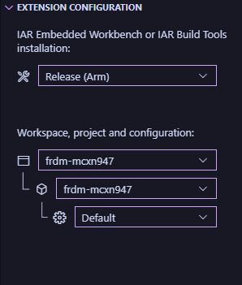

## Visual Studio Code integration
IAR maintains two VS Code extensions which embed compiling and debugging functionality of Embedded Workbench inside of VS Code.

### Installation
The easiest way to download the extensions is from the VS Code Marketplace:

1. From within VS Code, press **Ctrl+Shift+x** to open the Extensions panel.
2. Paste ``@publisher:IAR`` into the search bar. This will bring up the two extensions maintained by IAR, "IAR Build" and "IAR C-SPY Debug".
3. Install both extensions.

### Opening an Embedded Workbench Project in VS Code
1. Open the folder containing the Embedded Workbench project you want to test by pressing **Ctrl+k Ctrl+o**, or navigating to **File -> Open Folder...**
2. After you installed the extensions in the previous step, a new view "IAR Build" should have popped up in the Activity Bar to the left which you can click on.
3. From the "IAR Build" view, under the "Extension Configuration" section specify the path to the IAR Embedded Workbench installation folder as shown in the image below:

    

4. Both the workspace and the project files should automatically be detected from the folder you opened in VS Code, as shown in the above image.

Now you are ready to build and debug an Embedded Workbench project from inside VS Code.

### Building with the IAR Build Extension
1. To start building an Embedded Workbench project, first navigate to **Terminal -> Run Task**.
2. In the search bar that pops up, search for "iar" and then select "iar".
3. Select "iar: Build Project".

This will simply build the project inside of VS Code according to the settings specified in the Embedded Workbench project.
When you build the project, a terminal opens up showing the build output messages.

### Debugging with the IAR C-SPY Debug Extension
1. To start a new debugging session, first press **F5** or navigate to **Run -> Start Debugging**.
2. In the search bar that pops up, enter "iar" and click on "IAR C-SPY Debug".

Once the debug session has been loaded up, the debug toolbar shown in the image below will appear which can be used to control the debugging session:

#### Bug: Unresponsive Debugger After Resetting During Execution
Be aware that some debugger drivers do not support resetting the debugging session while it is executing. 
While debugging in EWARM, this should not be a problem.
Due to a bug in VS Code however, if a restart request fails after you have started executing the program, the debugger will become unresponsive.
At that point, you can try pressing **Shift+F5** or clicking on the stop button in the debug toolbar to try stopping the debugging session, and then start a new one.
Be aware that the the debug toolbar might remain unresponsive and will not disappear even when you stop the debugging session, until a new debugging session is started.

---

[Previous: Compiling and Debugging with Embedded Workbench](./compiling-debugging.md)

[Back to README](../README.md)
